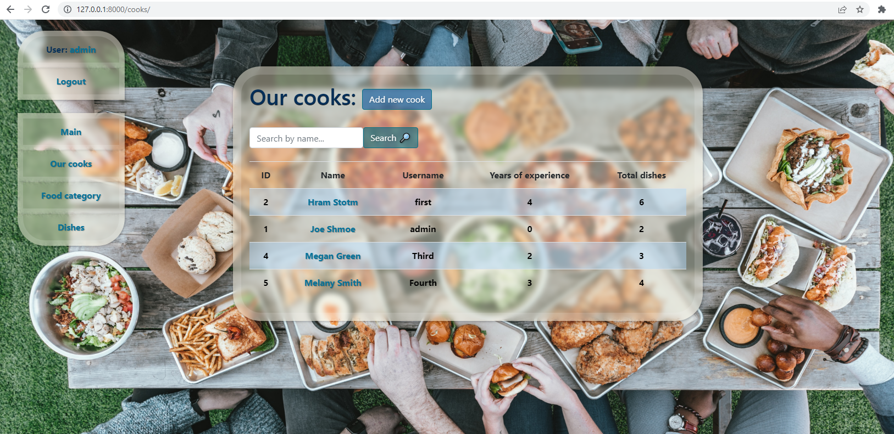

# Catering-service

Django project for managing catering service with dishes, food categories and cooks

## Check it out!

[Catering service deployed on Render](PASTE_LINK_HERE)

## Login to website:
login: guest
password: aelrjhn37

## Installation

Python3 must be already installed

```shell
git clone https://github.com/matechris/newspaper-agency-project.git
cd newspaper-agency-project
python3 -m venv venv
source venv/bin/activate
pip install -r requirements.txt
python manage.py runserver # starts Django Server
```

## Features

* Authentication functionality for Cook/User
* Managing cooks, food categories and dishes directly from website
* Powerful admin panel for advanced managing

## Demo


